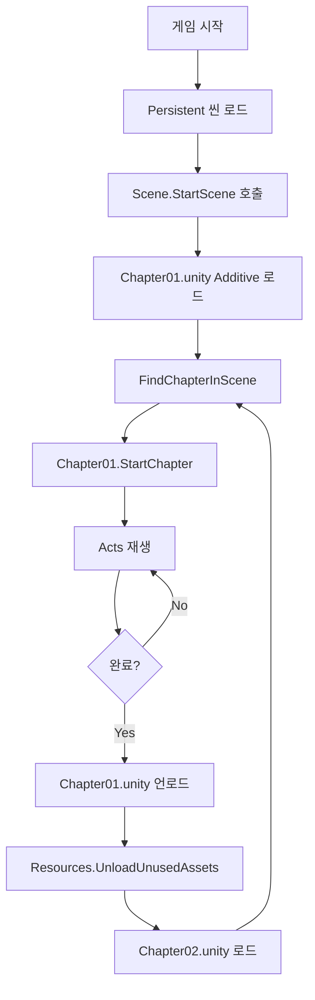

# 멀티 씬 구조 변경사항

## 📋 요약

각 챕터마다 다른 배경(스카이박스, 배경 오브젝트)을 사용하면서도 매니저와 플레이어를 공유하는 **멀티 씬 구조**를 구현했습니다.

---

## 🎯 해결한 문제

**문제:**
- 10개의 챕터가 예정되어 있음
- 각 챕터마다 다른 배경 필요
- 매니저와 플레이어는 공통으로 사용
- 기존 구조: 한 씬에 모든 챕터

**해결:**
- Persistent 씬 (매니저, 플레이어)
- 챕터별 씬 (배경, Chapter 컴포넌트)
- Additive 로딩으로 챕터 씬 동적 로드/언로드

---

## 📝 변경된 파일

### 1. `Scene.cs` (수정됨) ⭐

**추가된 기능:**
```csharp
// 멀티 씬 모드 토글
[SerializeField] private bool useMultiSceneLoading = true;

// 챕터 씬 이름 리스트 (멀티 씬 모드용)
[SerializeField] private List<string> chapterSceneNames;

// 챕터 씬 로드/언로드
private IEnumerator LoadChapterScene(string chapterSceneName)
private IEnumerator UnloadChapterScene()
private Chapter FindChapterInScene(Scene scene)

// 퍼블릭 API
public int TotalChapters
public void AddChapterScene(string chapterSceneName)
public void RemoveChapterScene(string chapterSceneName)
```

**작동 방식:**
1. `useMultiSceneLoading = true`: 챕터 씬을 Additive로 로드
2. `chapterSceneNames` 리스트에서 씬 이름 가져오기
3. 씬 로드 후 `FindChapterInScene()`으로 Chapter 컴포넌트 자동 찾기
4. 챕터 완료 시 씬 언로드 + 메모리 정리

---

### 2. `Chapter.cs` (변경 없음) ✅

기존 코드 그대로 사용 가능!
- 씬 이름 필드 필요 없음
- 자동으로 찾아짐

---

### 3. `SceneEditor.cs` (신규 생성) 🆕

**위치:** `Assets/Scripts/Core/Editor/SceneEditor.cs`

**기능:**
- Scene 컴포넌트의 Custom Inspector
- 멀티 씬 모드와 단일 씬 모드 UI 자동 전환
- Quick Setup 버튼으로 10개 챕터 자동 생성
- 런타임 정보 표시 및 컨트롤

**UI 개선:**
```
[Quick Setup (10 Chapters)] 버튼 → Chapter01~10 자동 생성
[+ Add Chapter Scene] → 챕터 씬 하나씩 추가
[Clear All] → 모든 챕터 삭제

런타임:
- 현재 챕터 인덱스/이름 표시
- [Start/Stop/Restart] 버튼
- [Skip to Next Chapter] 버튼
```

---

### 4. `SceneSetupChecklist.md` (신규 생성) 📋

**위치:** `Assets/Scripts/Core/SceneSetupChecklist.md`

**내용:**
- Persistent 씬 필수 설정 체크리스트
- Chapter 씬 필수 설정 체크리스트
- Build Settings 설정 가이드
- 주의사항 및 문제 해결
- 빠른 검증 체크리스트

수동으로 씬을 만들 때 참고할 필수 설정 가이드

---

### 5. 문서 (신규 생성) 📚

#### `README_MultiSceneSetup.md` (상세 가이드)
- 구조 설명
- 단계별 설정 방법
- 작동 원리
- 문제 해결

#### `README_QuickStart.md` (빠른 시작)
- 5분 안에 시작하기
- 시각적 다이어그램
- Inspector 미리보기
- 자주 하는 실수와 해결

#### `CHANGELOG_MultiScene.md` (이 파일)
- 변경사항 요약
- API 레퍼런스

---

## 🚀 사용 방법

### 수동 설정 (권장)

```
1. Persistent.unity 씬 생성
   - SceneManager (Scene.cs) 추가
   - Player, Camera, Canvas 배치

2. Scene.cs 설정
   - Use Multi Scene Loading ✅
   - Chapter Scene Names에 "Chapter01" 입력

3. Chapter01.unity 씬 생성
   - ChapterManager (Chapter.cs) 추가
   - 배경 오브젝트 배치
   - 스카이박스 설정

4. Build Settings
   - Persistent.unity 추가
   - Chapter01.unity 추가

5. Play!
```

---

## 📐 구조 다이어그램

### 씬 구조

```
Project
├── Scenes/
│   ├── Persistent.unity ← 항상 로드됨
│   ├── Chapter01.unity  ← Additive로 로드
│   ├── Chapter02.unity
│   └── ...
│
└── Scripts/Core/
    ├── Scene.cs         ← 수정됨
    ├── Chapter.cs       ← 변경 없음
    └── Editor/
        ├── SceneEditor.cs     ← 신규
        └── SceneSetupMenu.cs  ← 신규
```

### Hierarchy 구조

```
Persistent.unity
├── SceneManager (Scene.cs)
├── Player
├── Main Camera
└── Canvas

Chapter01.unity
├── ChapterManager (Chapter.cs)
│   └── Acts/
│       ├── Act01
│       └── Act02
└── Background/
    ├── Sky
    ├── Ground
    └── Props
```

---

## 🔄 작동 흐름



---

## 🎮 API 레퍼런스

### Scene.cs

#### Properties

```csharp
public bool IsPlaying { get; }
// 씬이 현재 재생 중인지

public int CurrentChapterIndex { get; }
// 현재 챕터 인덱스 (0-based)

public Chapter CurrentChapter { get; }
// 현재 활성 챕터 (null 가능)

public int TotalChapters { get; }
// 전체 챕터 개수
```

#### Methods

```csharp
public void StartScene()
// 첫 번째 챕터부터 씬 재생 시작

public void StopScene()
// 씬 재생 중지

public void RestartScene()
// 씬 재시작 (처음부터)

public void StartFromChapter(int chapterIndex)
// 특정 챕터부터 시작

public void SkipToNextChapter()
// 다음 챕터로 건너뛰기

public void AddChapterScene(string chapterSceneName)
// 챕터 씬 이름 추가 (멀티 씬 모드)

public void RemoveChapterScene(string chapterSceneName)
// 챕터 씬 이름 제거 (멀티 씬 모드)
```

---

### Inspector 설정

#### Scene Component

```
Scene Name: 씬 이름
Description: 설명
Use Multi Scene Loading: ✅ 멀티 씬 모드 사용

[멀티 씬 모드]
Chapter Scene Names:
  0: Chapter01
  1: Chapter02
  ...

[Quick Setup (10 Chapters)] - 자동으로 10개 생성
[+ Add Chapter Scene]       - 하나씩 추가
[Clear All]                 - 모두 삭제
```

---

## ⚡ 성능 특성

### 메모리 사용

| 시점 | 메모리 사용 |
|------|-------------|
| Persistent 씬만 | ~10MB |
| + Chapter01 | ~60MB |
| Chapter01 언로드 후 | ~10MB (원래대로) |
| + Chapter02 | ~55MB |

### 로딩 시간

| 작업 | 시간 |
|------|------|
| 챕터 씬 로드 | ~0.5~2초 (배경 복잡도에 따라) |
| 챕터 씬 언로드 | ~0.1~0.5초 |
| 메모리 정리 | ~0.2~1초 |

### 최적화 팁

1. **라이팅 베이크:** 각 챕터 씬에서 라이팅 미리 계산
2. **오클루전 컬링:** 배경이 복잡한 챕터에 적용
3. **에셋 번들:** 매우 큰 챕터는 에셋 번들 고려
4. **로딩 화면:** 로딩 중 페이드/스피너 표시

---

## 🐛 문제 해결

### "Scene 'Chapter01' couldn't be loaded"

**원인:** Build Settings에 씬이 없음

**해결:**
```
Tools > The Feelies > Add All Scenes to Build Settings
```

---

### "No Chapter component found in scene: Chapter01"

**원인:** Chapter01 씬에 Chapter.cs 컴포넌트가 없음

**해결:**
```
Chapter01 씬 열기
→ GameObject 생성
→ Chapter.cs 컴포넌트 추가
```

---

### "Player가 챕터 전환 시 사라짐"

**원인:** Player가 챕터 씬에 있음

**해결:**
```
Player를 Persistent 씬으로 이동
```

---

### "메모리가 계속 증가"

**원인:** 언로드가 제대로 안됨

**확인:**
```
1. Scene.cs의 UnloadChapterScene() 호출 확인
2. Profiler > Memory에서 챕터 전환 시 메모리 확인
3. static 변수나 이벤트 리스너 누수 확인
```

---

## 🔮 향후 개선 가능 사항

### 1. 로딩 화면
```csharp
// LoadingScreen.cs 추가
public class LoadingScreen : MonoBehaviour
{
    public void Show() { /* 페이드 인 */ }
    public void Hide() { /* 페이드 아웃 */ }
}

// Scene.cs에서
yield return loadingScreen.Show();
yield return LoadChapterScene(sceneName);
yield return loadingScreen.Hide();
```

---

### 2. 챕터 프리로드
```csharp
// 다음 챕터를 미리 로드 (백그라운드)
private IEnumerator PreloadNextChapter()
{
    if (currentChapterIndex + 1 < chapterSceneNames.Count)
    {
        string nextScene = chapterSceneNames[currentChapterIndex + 1];
        AsyncOperation op = SceneManager.LoadSceneAsync(nextScene, LoadSceneMode.Additive);
        op.allowSceneActivation = false; // 로드만 하고 활성화는 안함
        
        while (op.progress < 0.9f)
            yield return null;
        
        // 나중에 op.allowSceneActivation = true로 즉시 활성화
    }
}
```

---

### 3. 챕터 전환 이펙트
```csharp
// 페이드 아웃 → 씬 전환 → 페이드 인
yield return FadeOut();
yield return UnloadChapterScene();
yield return LoadChapterScene(nextScene);
yield return FadeIn();
```

---

### 4. 세이브/로드 시스템
```csharp
[System.Serializable]
public class SaveData
{
    public int currentChapterIndex;
    public int currentActIndex;
    // ...
}

public void SaveProgress()
{
    var data = new SaveData
    {
        currentChapterIndex = this.currentChapterIndex,
        currentActIndex = CurrentChapter?.CurrentActIndex ?? 0
    };
    // JSON으로 저장
}

public void LoadProgress()
{
    // JSON에서 로드
    StartFromChapter(data.currentChapterIndex);
}
```

---

## 📚 참고 자료

### Unity 공식 문서
- [Multi Scene Editing](https://docs.unity3d.com/Manual/MultiSceneEditing.html)
- [SceneManager API](https://docs.unity3d.com/ScriptReference/SceneManagement.SceneManager.html)
- [Additive Scene Loading](https://docs.unity3d.com/Manual/LoadingScenes.html)

### 프로젝트 문서
- `README_QuickStart.md` - 빠른 시작 가이드
- `README_MultiSceneSetup.md` - 상세 설정 가이드
- `README_NewStorySystem.md` - 기존 스토리 시스템 문서

---

## ✅ 체크리스트

완료한 항목을 체크하세요:

### 기본 설정
- [ ] Persistent 씬 생성됨
- [ ] Scene.cs 컴포넌트 설정됨
- [ ] Use Multi Scene Loading 체크됨
- [ ] Quick Setup으로 챕터 리스트 생성됨

### 챕터 씬
- [ ] Chapter01 씬 생성됨
- [ ] Chapter 컴포넌트 추가됨
- [ ] 배경 오브젝트 배치됨
- [ ] 스카이박스 설정됨
- [ ] 라이팅 베이크됨

### Build Settings
- [ ] Persistent 씬 추가됨 (첫 번째)
- [ ] 모든 챕터 씬 추가됨

### 테스트
- [ ] Play 버튼으로 테스트 성공
- [ ] Chapter01 로드 확인
- [ ] Chapter01 완료 후 언로드 확인
- [ ] 메모리 정리 확인 (Profiler)

---

## 💬 피드백 & 기여

개선 사항이나 버그를 발견하면 팀에 공유해 주세요!

**작성일:** 2025-11-22  
**버전:** 1.0.0  
**작성자:** AI Assistant

